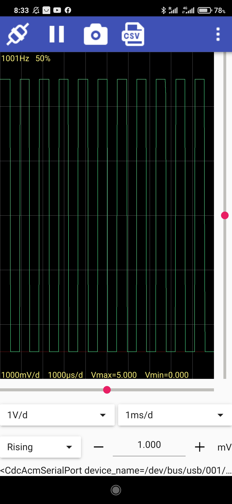

# Oscilloscope Serial

An oscilloscope application that reads the values at serial port generated by an Arduino board and based on the value of the analog pin A0

 
  <i>Main window</i>  

 
  <i>Settings</i>  

  
 
  <i>Main window Android</i>  

The Arduino sketch is optimized for AVR ATmega MCUs with 26μs sampling resolution. For other boards the resolution is 200μs. Voltage resolution is 20mV.

Flash _oscilloscope_. In the Oscilloscope app configure the serial port. By default 1000000bps, 8bits and no parity. Interval is 26μs for AVR ATmega and 200μs for other MCUs. Any source (1byte) at serial is valid.

You can connect any signal up to 5 volts to the analog pin A0. For signals over 5V a voltage divider is needed.

For ATmega boards it is defined a PWM signal at pin OC1B. To test the Oscilloscope app connect pin OC1B to pin A0
Adjust PWM signal with PWM_FREQ and PWM_DUTY. Default is 1000Hz, 50% duty.

Pin OC1B location:
 - Uno:        pin 10 (PB2)
 - Leonardo:   pin 10 (PB6)
 - ATmega2560: pin 12 (PB6)

Find binaries [here](https://github.com/dgatf/Oscilloscope/releases)

Or build from sources:
- install qt (>=5.15)
- cd to src/qt folder
- qmake
- make

Supported OS:

 - Linux
 - Windows
 - Android
 - MacOS (untested)

## Change log:

[v0.2](https://github.com/dgatf/Oscilloscope/releases/tag/v0.2)
- Upgrade to qml gui
- Add csv export
- Improve android support 

[v0.1](https://github.com/dgatf/Oscilloscope/releases/tag/v0.1)
- Initial release