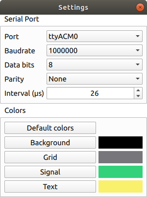

# Oscilloscope Serial

A simple oscilloscope application that reads the values at serial port generated by an Arduino board and based on the value of the analog pin A0

 
  <i>Main window</i>  

 
  <i>Settings</i>  

Flash oscilloscope.ino to an arduino board. In the Oscilloscope gui settings select the serial port with correct properties. By default 1000000bps, 8bits, no parity, 1 stop bit and no flow control and an interval of 100us between analog readings. 

You can connect any signal up to 5 volts to the analog pin A0. For signals over 5V a voltage divider is needed.

For ATmega boards there is a PWM signal at pin B2(OC1B). To test the Oscilloscope app connect pin B2 to pin A0
Adjust PWM signal with PWM_FREQ and PWM_DUTY. Default is 100Hz, 50% duty.

Pin B2 location:
  - Uno, Leonardo: pin 10
  - ATmega2560: pin 12

To build the Oscilloscope app:
- install qt
- cd to src/qt folder
- qmake
- make
